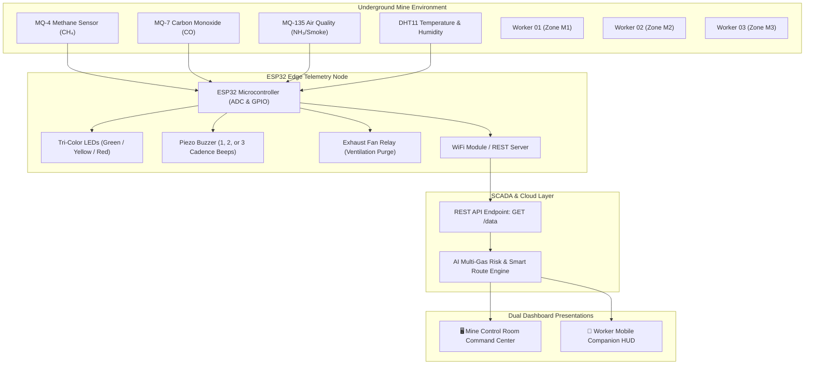

# 🛡️ SMART MINE SAFETY CONTROL CENTER
## AI-Based Mine Gas Leakage Detection and Smart Evacuation System
### Final Year Engineering College Prototype — Documentation & Viva Guide

---

## 📌 1. Project Overview & Abstract

Underground mining environments present extreme occupational hazards due to the accumulation of toxic and explosive gases (**Methane $CH_4$**, **Carbon Monoxide $CO$**, and hazardous particulate matter), accompanied by elevated ambient temperatures and relative humidity. Traditional mining safety systems rely on periodic manual inspections or isolated audio buzzers that do not provide directional egress guidance during emergencies.

This project introduces an **AI-Based Mine Gas Leakage Detection and Smart Evacuation System**. The system integrates multi-gas IoT sensory nodes (**MQ-4**, **MQ-7**, **MQ-135**, and **DHT11**) linked with an **ESP32 microcontroller** and a modern, high-contrast, dual-persona industrial command dashboard. 

The dashboard serves two core roles simultaneously:
1. **Mine Control Room Operators (Desktop View)**: Comprehensive telemetry command center with an interactive 2D underground tunnel map, live sensor sparklines, composite environmental risk matrix, worker tracking table, automated SCADA response triggers, and chronological alert logs.
2. **Mine Workers (Mobile Companion HUD)**: High-priority, glanceable personal safety interface accessible on mobile phones or wearable displays mounted on miner helmets/armbands, prioritizing real-time hazard alerts and directional evacuation paths (`M2 ➔ M1 ➔ MAIN EXIT`).

---

## 🏗️ 2. System Architecture & Data Flow



---

## 🚦 3. Safety State Matrix & Thresholds

The system continuously assesses atmospheric conditions based on Indian and International Mine Safety Standards (DGMS & OSHA):

| Parameter | Sensor | Safe Range | Warning Threshold | Emergency Hazard | Unit |
| :--- | :--- | :--- | :--- | :--- | :--- |
| **Methane ($CH_4$)** | MQ-4 | $< 1,000$ | $1,000 - 2,500$ | $> 2,500$ | PPM |
| **Carbon Monoxide ($CO$)** | MQ-7 | $< 50$ | $50 - 200$ | $> 200$ | PPM |
| **Air Quality / Hazardous Gas** | MQ-135 | $< 300$ | $300 - 800$ | $> 800$ | PPM |
| **Ambient Temperature** | DHT11 | $< 35.0$ | $35.0 - 45.0$ | $> 45.0$ | °C |
| **Relative Humidity** | DHT11 | $45 - 75$ | $< 40$ or $> 80$ | $> 85$ | % RH |

### Safety States:
- 🟢 **SAFE**: System operating normally. Atmospheric conditions within legal limits. Green LED active, single heartbeat buzzer chirp every 15s, baseline 40% fan ventilation.
- 🟡 **WARNING**: Abnormal environmental conditions detected. Workers remain alert. Yellow LED active, double buzzer cadence, automated ventilation boost to 100%.
- 🔴 **EMERGENCY**: Dangerous gas/temperature condition detected. Immediate evacuation required. Red LED flashing, triple/continuous buzzer alarm, automated rescue and medical SMS dispatches, dynamic route calculation bypassing hazardous zones.

---

## 🧭 4. Smart Evacuation Routing Algorithm

A critical innovation of this project is the **Hazard-Avoidance Dynamic Path Routing**:

> **Rule:** *Workers must never be routed through a hazardous zone.*

1. **When Zone M2 has a Gas Leak:**
   - **Miners inside M2**: Directed towards `M2 ➔ M1 ➔ MAIN EXIT`.
   - **Miners inside Deep Mine Zone M3**: Cannot transit through M2! The algorithm automatically activates the **Auxiliary Air Escape Shaft** bypass: `M3 ➔ AUXILIARY ESCAPE SHAFT ➔ MAIN EXIT`.
2. **When Zone M1 has an Emergency Hazard:**
   - Miners in M2 and M3 are routed through the Auxiliary Escape Shaft.
3. **When Zone M3 has an Emergency Hazard:**
   - Miners in M3 evacuate towards `M3 ➔ M2 ➔ M1 ➔ MAIN EXIT`.

---

## 💻 5. REST API JSON Specification (Render Cloud Integration)

The web dashboard is fully deployed on Render at:
**`https://smart-mine-safety-control-center.onrender.com`**

### A. ESP32 Ingestion Endpoint (`POST /api/esp32/data`)
Physical ESP32 microcontrollers transmit sensor readings to this endpoint over HTTPS:

```http
POST /api/esp32/data HTTP/1.1
Host: smart-mine-safety-control-center.onrender.com
Content-Type: application/json
X-API-Key: MINE_SECURE_ESP32_TOKEN_2026

{
  "device_id": "ESP32_M1",
  "zone": "M1",
  "mq4": 1234,
  "mq7": 856,
  "mq135": 642,
  "temperature": 32.5,
  "humidity": 68.0,
  "risk_level": "MEDIUM",
  "status": "WARNING"
}
```

### B. Live Telemetry & Device Status Stream (`GET /api/esp32/data`)
Dashboard automatically polls this endpoint every 2.5 seconds to detect online/offline state and receive real-time data without page refreshes.

### C. Recent Sensor History Query (`GET /api/esp32/history`)
Queries recent telemetry packets stored in the SQLite database (`mine_safety.db`).

---

## 🔌 6. ESP32 Hardware Wiring Table

| Component | Sensor Pin | ESP32 GPIO Pin | Type / Function |
| :--- | :--- | :--- | :--- |
| **MQ-4 Methane** | AOUT | `GPIO 34` (ADC1_CH6) | Analog Input |
| **MQ-7 Carbon Monoxide** | AOUT | `GPIO 35` (ADC1_CH7) | Analog Input |
| **MQ-135 Air Quality** | AOUT | `GPIO 32` (ADC1_CH4) | Analog Input |
| **DHT11 Temperature** | DATA | `GPIO 4` | Digital Bidirectional |
| **Green LED (Safe)** | Anode (+) | `GPIO 18` | Digital Output |
| **Yellow LED (Warn)** | Anode (+) | `GPIO 19` | Digital Output |
| **Red LED (Danger)** | Anode (+) | `GPIO 21` | Digital Output |
| **Piezo Buzzer** | Positive (+) | `GPIO 22` | Digital / PWM Tone |
| **Ventilation Relay** | IN (Signal) | `GPIO 23` | Digital Relay Control |
| **Power Supply** | VCC / GND | `5V` & `GND` | Common Ground Rail |

---

## 🚀 7. How to Run & Demonstrate the System

### Option A: Direct Browser Launch (Zero Dependencies)
Double-click `index.html` in your file explorer to open it in Chrome, Edge, or Firefox. The dashboard runs 100% locally with all built-in SVG graphics, Web Audio API tone synthesis, live sparklines, and interactive scenario simulator!

### Option B: Local HTTP Server (For Testing REST API)
Run the included Python mock server:
```powershell
python esp32_mock_server.py 5000
```
Then visit:
- **Dashboard**: `http://localhost:5000/`
- **REST API Endpoint**: `http://localhost:5000/api/data`

### Option C: Live College Demo Walkthrough
1. **Show Normal Operation**: Click **"Demo & ESP32"** ➔ Click **"🟢 NORMAL / SAFE"**. Note the green shield, 40% fan rotation, single buzzer pulse, and clear corridor routes.
2. **Demonstrate Warning Condition**: Click **"🟡 WARNING CONDITION"**. Observe yellow status, 100% ventilation fan spooling, double alert beeps, and updated worker state.
3. **Demonstrate Critical Gas Leak**: Click **"🔴 CRITICAL METHANE LEAK"**. Observe the emergency audio alarm, red laser theme, animated hazard epicenter on Zone M2 in the 2D tunnel map, and directional evacuation route arrows.
4. **Demonstrate Worker Mobile View**: Toggle **"📱 Worker View"** in the top navigation bar to demonstrate how the UI immediately adapts for a miner's smartphone or helmet wearable!

---

## 🎓 8. Viva Voce & Examiner Q&A Guide

**Q1: Why did you choose MQ-4, MQ-7, and MQ-135 gas sensors?**
> *Answer:* Methane ($CH_4$) is lighter than air and explosive at concentrations above 5% (50,000 ppm), monitored by MQ-4. Carbon Monoxide ($CO$) is odorless, highly toxic, and forms from incomplete coal combustion, monitored by MQ-7. MQ-135 detects ammonia, sulfides, and toxic smoke. Together they cover explosive, poisonous, and particulate hazards.

**Q2: How does the Smart Evacuation System prevent workers from entering a danger zone?**
> *Answer:* The algorithm models the mine tunnel network as a directed weighted graph. Hazardous zones are assigned an infinite impedance/weight. If a leak occurs in Zone M2, the route engine redirects deep miners (M3) through the auxiliary air escape shaft rather than allowing them to cross the contaminated M2 tunnel corridor.

**Q3: How does the system handle communication in an underground mine where Wi-Fi might not reach deep shafts?**
> *Answer:* The ESP32 node acts as an edge computing device. Even if connectivity to the surface server is lost, the local node independently drives the tri-color LEDs, piezo buzzer cadences, and ventilation relay. In a full deployment, mesh networks (such as ESP-NOW or LoRaWAN 868/915 MHz) carry telemetry between subterranean nodes.

**Q4: What is the purpose of the 1, 2, and 3 buzzer beep cadences?**
> *Answer:* In a noisy underground environment with heavy machinery, continuous alarms can cause panic or sensory fatigue. The graduated cadence allows workers to immediately identify whether the tone is a routine operational heartbeat (1 pulse), an advisory to prepare respirators (2 pulses), or an immediate life-safety evacuation order (3 pulses).
