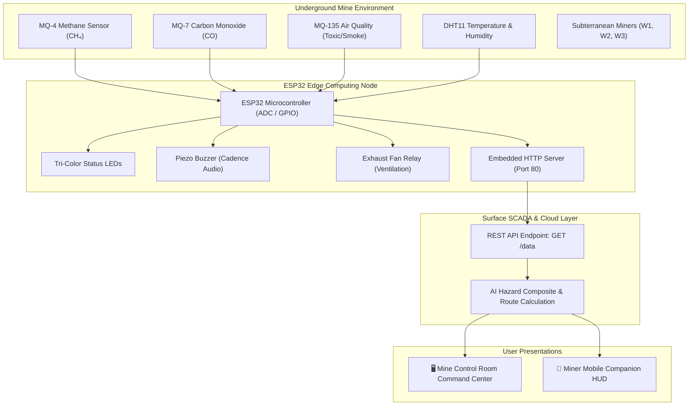

<div align="center">

# 🛡️ SMART MINE SAFETY CONTROL CENTER
### AI-Based Mine Gas Leakage Detection and Smart Evacuation System

[](LICENSE)
[](#contributing)
[](CONTRIBUTING.md)
[](#-hardware-wiring-specification)
[](esp32_mock_server.py)
[](#-quick-start)

*An open-source, dual-persona industrial SCADA command center and mobile wearable safety HUD designed for underground mine environments.*

[Live Overview](#-system-architecture) • [Features](#-key-features) • [Hardware Wiring](#-hardware-wiring-specification) • [Quick Start](#-quick-start) • [REST API](#-rest-api-specification) • [Contributing](CONTRIBUTING.md)

</div>

---

## 📖 About The Project

Underground mining environments are vulnerable to sudden catastrophic events such as **Methane ($CH_4$) gas explosions**, **Carbon Monoxide ($CO$) poisoning**, toxic smoke buildup, and localized fires. Traditional alarm systems in mines rely on deafening acoustic sirens that alert workers that danger exists, but provide **zero situational guidance** on which corridors are safe and which are death traps.

This open-source project introduces an **AI-Based Mine Gas Leakage Detection and Smart Evacuation System**. It combines multi-gas sensory acquisition (**MQ-4, MQ-7, MQ-135, and DHT11**) with an **ESP32 microcontroller** and an industrial-grade dark web dashboard that dynamically calculates and renders safe escape routes while isolating contaminated shafts.

### 👥 Dual-Persona Architecture
1. **🖥️ Mine Control Room Operators (Desktop Command)**: High-density situational awareness dashboard featuring a 2D interactive mine tunnel schematic, live sensor trend sparklines, multi-gas AI risk gauges, worker tracking tables, SCADA life-safety actuation monitors, and event feeds.
2. **📱 Mine Workers (Mobile Companion / Wearable HUD)**: Streamlined, high-contrast, glanceable mobile interface for miners carrying ruggedized smartphones or helmet displays, prioritizing real-time safety status, current zone, and oversized illuminated escape vectors (`M2 ➔ M1 ➔ MAIN EXIT`).

---

## ✨ Key Features

- **🛡️ 3-Stage Dynamic Life-Safety Status Engine**:
  - `🟢 SAFE`: Normal environmental operations, ambient monitoring active.
  - `🟡 WARNING`: Abnormal gas concentrations, worker alerts triggered, exhaust fan boosted to 100%.
  - `🔴 EMERGENCY`: Critical gas leak/temperature hazard, automated rescue and medical EMS dispatch alerts, dynamic tunnel diversion.
- **🗺️ Interactive 2D Mine Tunnel Map (SVG)**:
  - Vector schematic of Surface Elevation, Main Exit Portal, Zone M1 (Entry Shaft), Zone M2 (Tunnel Junction), Zone M3 (Deep Mine Face), and Auxiliary Air Escape Shaft.
  - Live color-coded zone status (Green, Yellow, Red) with animated hazard smoke waves.
  - Real-time worker position tracking pins (`W-01`, `W-02`, `W-03`).
- **🧭 Smart Evacuation Routing (Hazard Avoidance Algorithm)**:
  - **Core Rule**: *Workers are never routed through a hazardous zone.*
  - Dynamically calculates bypasses (e.g. routing deep miners through the secondary ventilation shaft if the central tunnel is compromised).
- **📡 Multi-Sensor Live Telemetry Cards**:
  - **MQ-4**: Methane ($CH_4$) in PPM
  - **MQ-7**: Carbon Monoxide ($CO$) in PPM
  - **MQ-135**: Air Quality Index / Toxic Gases in PPM
  - **DHT11**: Ambient Temperature (°C) & Relative Humidity (% RH)
  - Live rolling trend sparklines with 1.0 Hz sampling.
- **📊 AI Environmental Risk Analysis**:
  - Multi-gas weighted composite risk assessment engine (0% to 100%).
  - Individual progress bars with automatic color shifts based on hazard ceilings.
- **💡 Microcontroller GPIO Actuator Simulation**:
  - Tri-color physical LEDs (Green, Yellow, Red) mirroring.
  - Realistic **Piezo Buzzer Cadence Simulator** using the **Web Audio API** (1 pulse for Safe, 2 pulses for Warning, 3 pulses for Emergency alarm) with built-in mute controls.
  - Industrial exhaust ventilation fan with smooth CSS rotation speed modulation.
- **🚨 Automated Emergency Dispatch Matrix**:
  - Instantaneous trigger logs for Control Room, Rescue Brigade (SMS), Ambulance (108 EMS), and SCADA ventilation systems.
- **⚙️ Built-In College Demo & ESP32 Simulator**:
  - 1-click test scenarios for presentations and examinations: *Normal Safe*, *Warning State*, *Critical Methane Leak*, and *Deep Mine Toxic CO*.
  - Manual slider controls to dynamically adjust PPM and temperature values.
  - Configurable REST polling URL to hook into physical ESP32 hardware with one click.

---

## 🏗️ System Architecture



---

## 🔌 Hardware Wiring Specification

Connect the sensors and actuators to the ESP32 as outlined below:

| Component | Sensor Pin | ESP32 GPIO Pin | Channel / Type | Operating Voltage |
| :--- | :--- | :--- | :--- | :--- |
| **MQ-4 Methane** | AOUT | `GPIO 34` | ADC1_CH6 (Analog) | 5V VCC |
| **MQ-7 Carbon Monoxide** | AOUT | `GPIO 35` | ADC1_CH7 (Analog) | 5V VCC |
| **MQ-135 Air Quality** | AOUT | `GPIO 32` | ADC1_CH4 (Analog) | 5V VCC |
| **DHT11 Temp & Humidity** | DATA | `GPIO 4` | Digital I/O | 3.3V / 5V |
| **Green LED (Safe)** | Anode (+) | `GPIO 18` | Digital Output | 3.3V (220Ω Resistor) |
| **Yellow LED (Warning)** | Anode (+) | `GPIO 19` | Digital Output | 3.3V (220Ω Resistor) |
| **Red LED (Danger)** | Anode (+) | `GPIO 21` | Digital Output | 3.3V (220Ω Resistor) |
| **Piezo Buzzer** | Positive (+) | `GPIO 22` | Digital / PWM | 3.3V / 5V |
| **Ventilation Relay** | IN (Signal) | `GPIO 23` | Digital Output | 5V VCC |

> [!NOTE]
> Ensure a **common ground (GND)** is shared between the ESP32 and external 5V power supply modules.

---

## 🚀 Quick Start

### Option 1: Standalone Browser Launch (Zero Installation)
Because the frontend is built entirely using vanilla modern web standards (HTML5, CSS3, JavaScript ES6+, SVG, Web Audio API), **no build step or package manager is required**:
1. Clone or download this repository:
   ```bash
   git clone https://github.com/your-username/smart-mine-safety-control-center.git
   cd smart-mine-safety-control-center
   ```
2. Simply double-click `index.html` to open it in Chrome, Edge, Safari, or Firefox!

---

### Option 2: Run with Python Mock REST Server
A complete Python test server is included to serve the dashboard and provide the live REST endpoint:
1. Ensure Python 3.8+ is installed.
2. Start the server on port 5000:
   ```bash
   python esp32_mock_server.py 5000
   ```
3. Open your browser:
   - **Dashboard**: `http://localhost:5000/`
   - **REST API Data Endpoint**: `http://localhost:5000/api/data`

---

### Option 3: Connect Physical ESP32 Hardware
1. Open [`esp32_firmware_sample.ino`](esp32_firmware_sample.ino) in the Arduino IDE.
2. Install the required libraries via Library Manager:
   - `DHT sensor library` by Adafruit
   - `ArduinoJson` (v6 or v7) by Benoît Blanchon
3. Update your WiFi credentials:
   ```cpp
   const char* ssid = "YOUR_WIFI_SSID";
   const char* password = "YOUR_WIFI_PASSWORD";
   ```
4. Flash the sketch to your ESP32 board.
5. Note the assigned IP address in the Serial Monitor (e.g., `http://192.168.1.100`).
6. On the web dashboard, click **"Demo & ESP32"**, enter your ESP32's endpoint (`http://192.168.1.100/data`), and toggle **"Enable Real ESP32 Live Polling"**.

---

## 📡 REST API Specification

### `GET /api/data`
Returns real-time telemetry from the mine safety monitoring node.

#### Response Example:
```json
{
  "zone": "M2",
  "location": "Mine Zone M2",
  "methane": 1800,
  "co": 1200,
  "mq135": 1400,
  "temperature": 38.0,
  "humidity": 65.0,
  "status": "WARNING",
  "safeRoute": "M2 -> M1 -> MAIN EXIT"
}
```

### `POST /api/data`
Injects telemetry into the server from external sensor gateways or simulators.

---

## 📂 Repository File Structure

```
├── index.html                 # Main dashboard markup (Control Room + Worker HUD)
├── styles.css                 # Industrial dark UI, tactical animations & responsive CSS
├── app.js                     # State engine, AI risk scoring, routing, and Web Audio buzzer
├── esp32_mock_server.py       # Python HTTP server & CORS-enabled REST API endpoint
├── esp32_firmware_sample.ino  # Ready-to-flash Arduino ESP32 firmware
├── PROJECT_GUIDE.md           # Engineering report, viva voce guide, & circuit notes
├── LICENSE                    # MIT Open Source License
├── CONTRIBUTING.md            # Guidelines for community contributions
├── CODE_OF_CONDUCT.md         # Contributor Covenant Code of Conduct
├── package.json               # NPM package manifest for web developers
├── requirements.txt           # Python dependency reference
└── .github/                   # GitHub templates for issues and pull requests
```

---

## 🤝 Contributing

Contributions are warmly welcomed! Whether you want to add LoRaWAN communication, integrate 3D Three.js tunnel rendering, or write new sensor drivers:

1. Fork the Project
2. Create your Feature Branch (`git checkout -b feature/AmazingFeature`)
3. Commit your Changes (`git commit -m 'Add some AmazingFeature'`)
4. Push to the Branch (`git push origin feature/AmazingFeature`)
5. Open a Pull Request

Please review [CONTRIBUTING.md](CONTRIBUTING.md) and [CODE_OF_CONDUCT.md](CODE_OF_CONDUCT.md) before submitting code.

---

## 📜 License

Distributed under the **MIT License**. See [`LICENSE`](LICENSE) for more information.

---

## 🎓 Academic Citation

If you use this project in your academic research, university coursework, or final-year engineering prototype, please consider citing:

```bibtex
@misc{smart_mine_safety_2026,
  author = {Abinesh TS and Contributors},
  title = {AI-Based Mine Gas Leakage Detection and Smart Evacuation System},
  year = {2026},
  publisher = {GitHub},
  howpublished = {\url{https://github.com/your-username/smart-mine-safety-control-center}}
}
```

<div align="center">
  <sub>Built with ❤️ for Mine Worker Safety and Open Source Engineering.</sub>
</div>
